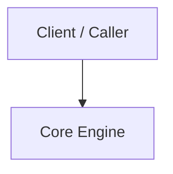

# Real-Time-IoT-Dashboard

A modern Python project engineered by Krishna Patil.

[](LICENSE) [](https://github.com/kriss2012/Real-Time-IoT-Dashboard)

---

## 📌 Overview

**Real-Time-IoT-Dashboard** is engineered for clarity, modularity, and high-performance execution.

## 🛠️ Tech Stack

- **Languages**: Python

## 🏛️ Architecture



## 🚀 Getting Started

### Prerequisites
- Git
- Python Runtime Environment

### Installation

```bash
# Clone repository
git clone https://github.com/{self.username}/{name}.git
cd {name}
python -m venv venv
# Activate environment
# Windows: .\venv\Scripts\activate | Linux/macOS: source venv/bin/activate
pip install -r requirements.txt
```

### Running the Application

```bash
python main.py  # (or entrypoint script)
```

## 🔒 Security

For security policies and reporting vulnerabilities, please see [SECURITY.md](SECURITY.md).

## 🤝 Contributing

Contributions, issues, and feature requests are welcome! See [CONTRIBUTING.md](CONTRIBUTING.md) for contribution guidelines and code of conduct.

## 📄 License

This project is licensed under the MIT License - see the [LICENSE](LICENSE) file for details.

## 👤 Author

Developed by **[Krishna Patil](https://github.com/kriss2012)**.

---

## Author

Developed and maintained by **[Krishna Patil](https://github.com/kriss2012)**.
